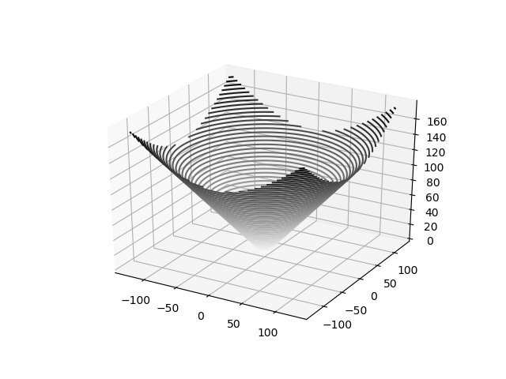
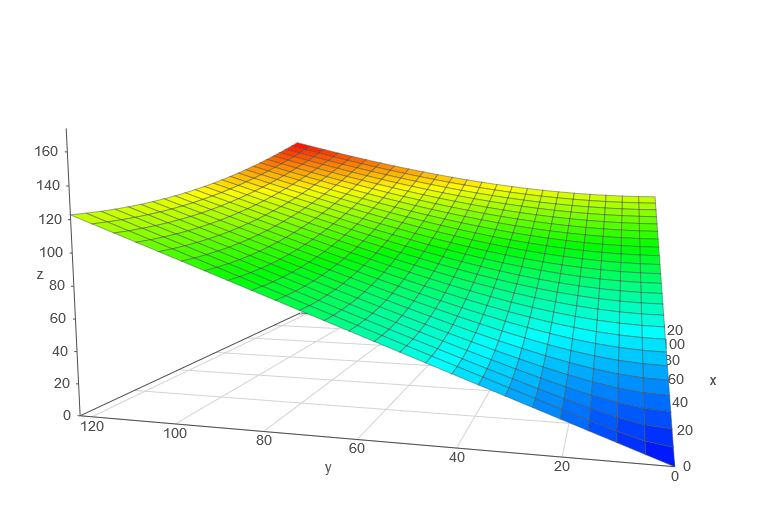
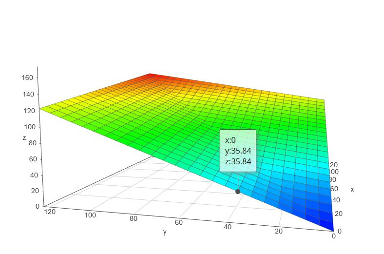
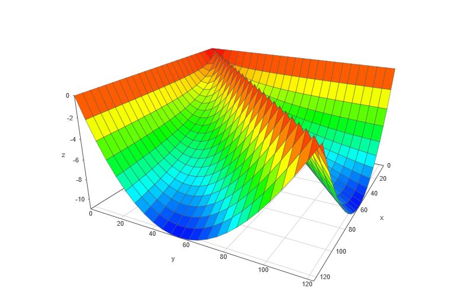
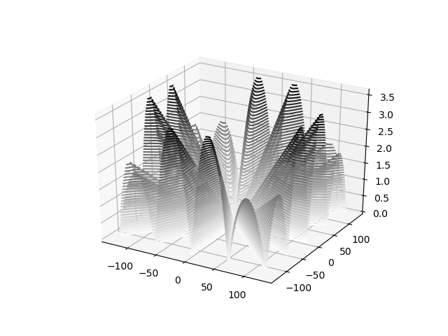
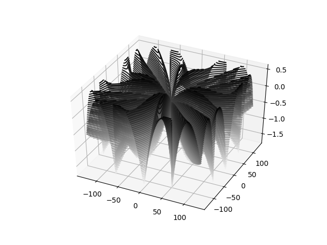
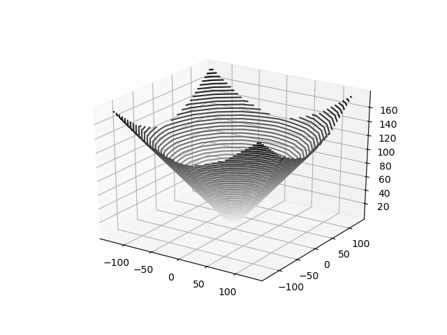

# Calcul de la norme euclidienne sur glOric

Voici comment a été obtenu l'algorithme de calcul de la norme euclidienne:
 z = sqrt (x^2 + y^2)



Cette fonction et symétrique, on peut se concentrer uniquement sur les valeurs positives de x et y.

Voici à quoi ressemble cette fonction sur l'espace des x et y positifs:



Comme c'est très "plat", ma première idée avait été de l'approximer par un plan en interpolant linéairement entre les axes x=0 et y=x par un algo de la forme:

```
SI abs(x)>abs(y)
	Z = abs(x) + abs(y) * (sqrt(2) -1)
SINON
	Z = abs(x) + abs(y) * (sqrt(2) -1)
FINSI
```

Voici à quoi ressemble ce plan.



Obtenu en tapant :`if (x>y, x + y * (sqrt(2) -1), y + x * (sqrt(2) -1))` sur [academo.org](https://academo.org/demos/3d-surface-plotter/?expression=if(x%3Ey%2Cx%2By*(sqrt(2)-1)%2Cy%2Bx*(sqrt(2)-1))&xRange=0%2C+128&yRange=0%2C+128&resolution=25)

L'intérêt c'est que le calcul n'implique que:
- une comparaison
- un adressage indexé (pour la multiplication par une constante qu'on peut mettre en abbaque)
- une addition.

Mais il s'est avéré que l'approximation par un plan était trop imprécise comme le montre la figure suivante représentant la différence entre la valeur réelle et l'approximation par un plan.



Obtenu en tapant :`if (x>y, sqrt (x^2 + y^2) - (x + y * (sqrt(2) -1)), sqrt (x^2 + y^2) -(y + x * (sqrt(2) -1)))` sur [academo.org]()

L'erreur arrive à plus de 10 en valeur absolue.

Après avoir constaté que l'erreur était la plus grande au centre ma zone d'approximation (là où Y = X/2), j'ai décidé de faire une approximation par deux plans pluôt qu'un.   

```
if ax >= ay:
	x, y = ax, ay
else:
	x, y = ay, ax
if y > x/2 :
	Z = C*x + D*Y
else:
	Z = A*x + B*y
```

L'intérêt de cette forme reste qu'en assembleur, elle peut se réaliser par :
- deux comparaisons
- deux adressages indirect
- une somme

Par le calcul manuel je suis arrivé à :
```
A = 1.0
B = math.sqrt(5) - 2
C = math.sqrt(5)-math.sqrt(2)
D = 2*math.sqrt(2) - math.sqrt(5)
```

Les résultats étaient déjà sympas comme le montre cette représentation de l'erreur (erreur inférieure à 3.5):



Mais je ne me suis pas arrêté là ..

J'ai utilisé cette combinaison de valeur comme point de départ d'une recherche de combinaison optimale, par regression linéaire des moindre carré sur l'erreur.

Et, puisque les tables de multiplication A, B, C et D allaient être des abbaques, je me suis dit qu'il était possible d'y mettre autre chose qu'une fonction affine. Et j'ai décidé de faire rechercher (par l'ordinateur du 21ème siècle) une fonction polynomiale du second ordre pour chaque table A B C et D

L'idée c'est de, tout en gardant le temps de calcul évoqué plus haut (puis que la fonction polynomiale sera mise en abbaque), disposer d'une fonction de calcul de la forme suivante:

```
if ax >= ay:
	x, y = ax, ay
else:
	x, y = ay, ax
if y > x/2 :
	Z = C2 * (x^2) + C1 * x + C0 + D2 * (y^2) + D1 * y + D0
else:
	Z = A2 * (x^2) + A1 * x + A0 + B2 * (y^2) + B1 * y + B0
```

Car un choix précis des coefficients A0, A1, A2, B0, B1, B2, C0, C1, C2, D0, D1, D2 permet aux erreurs de se compenser !!

L'erreur finale a cet aspect:



L'erreur est inférieure à 2 en valeur absolu et elle est un peu plus centrée autour de 0.

Après un tunning manuel de quelques valeurs proche de 0, je suis arrivé à une erreur inférieure à 11% (erreur d'arrondi comprise) sur tout le domaine de définition.

Il est possible d'aller enconre plus loin dans la fidélité de l'approximation en utilisant un algo de backtracking pour le choix des arrondis.

Le choix d'une approximation biplanaire a permis de diviser par trois le temps de calcul de la norme euclidienne.
Sans trop sacrifier à la précision.

 |Courbe idéale| Courbe approximée|
 |--|--|
 |||
