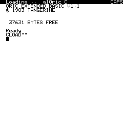
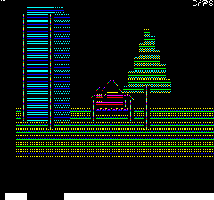

# glOric : Real Time 3D for Oric

Project __glOric__ aims at providing Oric's developpers with an hyper fast 3D library to use in real time applications.

## Starting with glOric

### Installing Pre-requisites

In order to use __glOric__, you have to first install a developpement environnement. The simplest way to do so is to download and install [OSDK](http://osdk.org/).

Next, you will need a git client to retreive the source code of __glOric__ from its repository on github. Download and install [GIT](https://git-scm.com/).


### Downloading glOric project

Getting glOric is simple. If you have a GIT client installed, just clone the [glOric repository](https://github.com/oric-software/glOric)
```
git clone --depth 1 --branch develop https://github.com/oric-software/glOric.git
```

Or, if you don't have GIT client installed, you can download an [archive of the project](https://github.com/oric-software/glOric/archive/develop.zip)


### Building glOric demos

A good starting point in using glOric consists in building and testing demos that are provided with the project.

3 demos are provided :
- a text based demo 


- a hires demo


- a lores demo 


- a color demo 




#### Selecting a demo to build
To choose between demos, open the `config.h` file located in the `src` directory of glOric and find the following section at the beginning of the file:

```C 
// Choose amongst TEXTDEMO, LRSDEMO, HRSDEMO, COLORDEMO
#define COLORDEMO
```

Change the line to `#define HRSDEMO` if you want ot build the HIRES mode demo. 

Change the line to `#define LRSDEMO` if you want ot build the LORES mode demo. 

Change the line to `#define TEXTDEMO` if you want ot build the text mode demo. 

Change the line to `#define COLORDEMO` if you want ot build the color mode demo. 

#### Building the demo

Once you have selected the demo you want to build, just open a shell command in the directory where you placed the source code and run following commands:

```
cd src
osdk_build.bat && osdk_execute.bat
```

It should start an Oricutron with the selected demo running in it.

#### Running the demo

These sample demos consists in:
- an intro in which the camera position and orientation is animated
- followed by an interactive phase where you can manually move the camera in order to test real time interactive mode.

In TEXT, LORES or COLOR mode sample demo , the camera is moved with the following keyboard commands:

- Arrow (up / down) to go ( forward / backward )
- W / X to shift (left / right)
- Arrow (left / right ) to rotate the camera
- Q / A to pitch (up / down)
- P / ; to go (up / down)

As in HIRES mode sample demo, the camera is moved with the following keyboard commands:

- Arrow (left / right ) to rotate around the object
- Q / A to go (up / down)


__Programing Interface__ is [described
here](docs/hyperfastproject.md) and [discussed here](http://forum.defence-force.org/viewtopic.php?f=24&t=2049#p20993).

__Demos__ are [provided and discussed here](http://forum.defence-force.org/viewtopic.php?f=21&t=2048#p20989).

__Source Code__ is [here](src).

For __Insight__ read the [article on the euclidian norm](docs/norm.md).


__Screenshots__
|||
|--|--|
|||


